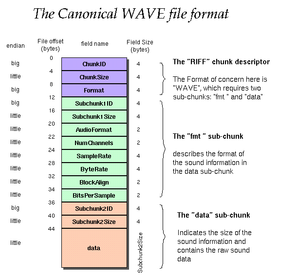
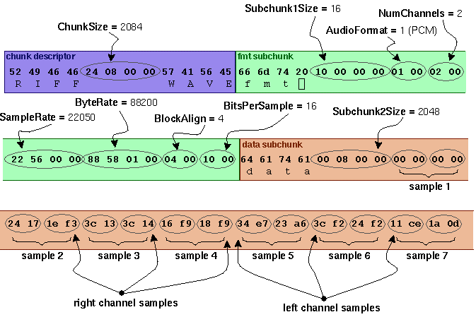

# Formato Wave

tomado de http://soundfile.sapp.org/doc/WaveFormat/

<pre>Offset  Size  Name             Description

The canonical WAVE format starts with the RIFF header:

0         4   <b>ChunkID</b>          Contains the letters "RIFF" in ASCII form
                               (0x52494646 big-endian form).
4         4   <b>ChunkSize</b>        36 + SubChunk2Size, or more precisely:
                               4 + (8 + SubChunk1Size) + (8 + SubChunk2Size)
                               This is the size of the rest of the chunk 
                               following this number.  This is the size of the 
                               entire file in bytes minus 8 bytes for the
                               two fields not included in this count:
                               ChunkID and ChunkSize.
8         4   <b>Format</b>           Contains the letters "WAVE"
                               (0x57415645 big-endian form).

The "WAVE" format consists of two subchunks: "fmt " and "data":
The "fmt " subchunk describes the sound data's format:

12        4   <b>Subchunk1ID</b>      Contains the letters "fmt "
                               (0x666d7420 big-endian form).
16        4   <b>Subchunk1Size</b>    16 for PCM.  This is the size of the
                               rest of the Subchunk which follows this number.
20        2   <b>AudioFormat</b>      PCM = 1 (i.e. Linear quantization)
                               Values other than 1 indicate some 
                               form of compression.
22        2   <b>NumChannels</b>      Mono = 1, Stereo = 2, etc.
24        4   <b>SampleRate</b>       8000, 44100, etc.
28        4   <b>ByteRate</b>         == SampleRate * NumChannels * BitsPerSample/8
32        2   <b>BlockAlign</b>       == NumChannels * BitsPerSample/8
                               The number of bytes for one sample including
                               all channels. I wonder what happens when
                               this number isn't an integer?
34        2   <b>BitsPerSample</b>    8 bits = 8, 16 bits = 16, etc.
          2   <b>ExtraParamSize</b>   if PCM, then doesn't exist
          X   <b>ExtraParams</b>      space for extra parameters

The "data" subchunk contains the size of the data and the actual sound:

36        4   <b>Subchunk2ID</b>      Contains the letters "data"
                               (0x64617461 big-endian form).
40        4   <b>Subchunk2Size</b>    == NumSamples * NumChannels * BitsPerSample/8
                               This is the number of bytes in the data.
                               You can also think of this as the size
                               of the read of the subchunk following this 
                               number.
44        *   <b>Data</b>             The actual sound data.

</pre>

